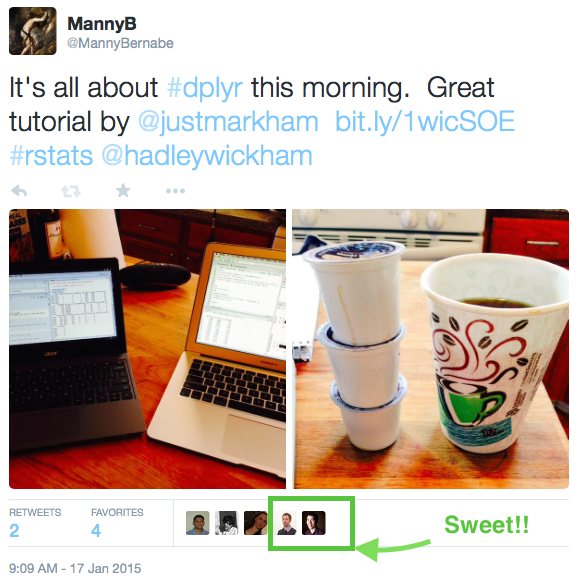

dplyr Tutorial by Data School's Kevin Markham
===============

dplyr package, developed by Hadley Wickham, makes data munging easier.

Kevin Markham has produced an excellent tutorial:
* [Video](https://www.youtube.com/watch?v=jWjqLW-u3hc)
* [R Markdown walk-through](http://rpubs.com/justmarkham/dplyr-tutorial)

Note that there have been considerable updates to ddplyer since this video was released.  Learn more [here](http://www.r-bloggers.com/dplyr-0-4-0/).

